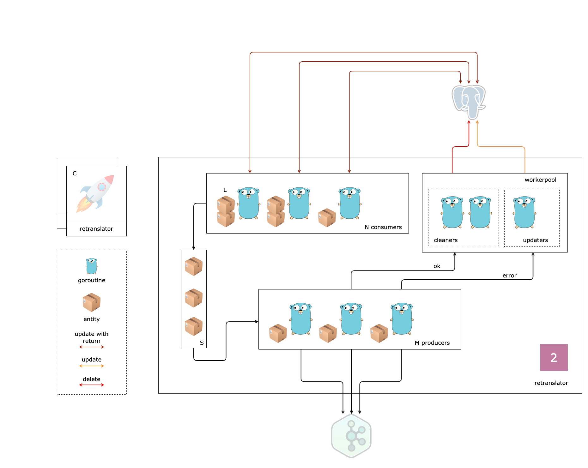

# Ozon Marketplace Project

Дальше везде используются **placeholder**-ы:
- `{domain}`,`{Domain}`
- `{subdomain}`,`{Subdomain}`

Например, для поддомена `package` из домена `logistic` значение **placeholder**-ов будет:
- `{domain}`,`{Domain}` = `logistic`,`Logistic`
- `{subdomain}`,`{Subdomain}` = `package`,`Package`
- `{domain}`/`{subdomain}` = `logistic`/`package`
---

### Задание 2

1. Создать репозиторий в формате `{domain-kw}-{subdomain}-api`

2. Описать сущность `{domain}.{Subdomain}` и `{domain}.{Subdomain}Event` в **internal/model/{subdomain}.go**

3. Реализовать паттерн consumer-producer из **db** в **kafka** на основе интерфейсов [EventRepo](https://github.com/ozonmp/omp-demo-api/blob/b847b3ae4a3c9e1d25e31e077c847a22f8b7aa99/internal/app/repo/event.go#L7) и [EventSender](https://github.com/ozonmp/omp-demo-api/blob/b847b3ae4a3c9e1d25e31e077c847a22f8b7aa99/internal/app/sender/event.go#L7) для одного типа события **Created**

4. Написать тесты

5. Синхронизацию работы потоков сделать через `context` 💎

6. Создавать задачи у **workerpool** по обработке батчевых идентификаторов записей событий 💎

7. Поддержать несколько типов событий учитывая корректный порядок 💎

8. Реализовать гарантию доставки **At-least-once** 💎

9. Найти скрытые ошибки в коде 💎

**Рецепт**

[omp-demo-api](https://github.com/ozonmp/omp-demo-api)

P.S. Обратите внимание используется зеркальная (внешняя) точка зрения на вопрос, кто является потребителем, а кто является производителем.
Поэтому паттерн назвали **consumer-producer** и классы переименовали.
