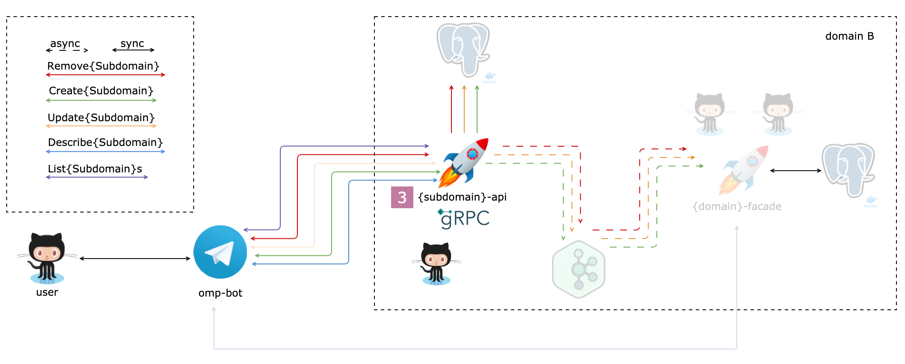

# Ozon Marketplace Project



Дальше везде используются **placeholder**-ы:

- `{domain}`,`{Domain}`
- `{subdomain}`,`{Subdomain}`

Например, для поддомена `package` из домена `logistic` значение **placeholder**-ов будет:

- `{domain}`,`{Domain}` = `logistic`,`Logistic`
- `{subdomain}`,`{Subdomain}` = `package`,`Package`
- `{domain}`/`{subdomain}` = `logistic`/`package`
- `{subdomains}`,`{Subdomains}` = `packages`,`Packages`

---

### Задание 3

1. Сделать **rebase** своего репозитория `{kw-domain}-{subdomain}-api` на [omp-template-api](https://github.com/ozonmp/omp-template-api)
2. Добавить в **proto** следующие **handler**-ы (пример [template](https://github.com/ozonmp/omp-template-api/blob/be1223fb1d1c9751b0d9db1d6e2dfff6ba4c9316/protos/ozonmp/omp_template_api/v1/omp_template_api.proto)):
   1. `Create{Subdomain}`
   2. `Describe{Subdomain}`
   3. `List{Subdomains}`
   4. `Remove{Subdomain}`
3. Добавить теги валидации в поля сообщений (пример [template](https://github.com/ozonmp/omp-template-api/blob/be1223fb1d1c9751b0d9db1d6e2dfff6ba4c9316/protos/ozonmp/omp_template_api/v1/omp_template_api.proto#L28))
4. Сделать рефакторинг: заменить `template` на `{subomain}` (см. рецепт)
5. Сгенерировать **gRPC** код клиента и сервера (make generate)
6. Имплементировать код новых ручек в **internal/api/api.go** (пример [template](https://github.com/ozonmp/omp-template-api/blob/be1223fb1d1c9751b0d9db1d6e2dfff6ba4c9316/internal/api/api.go#L34))
   1. Код ручек должен просто логгировать вызовы (с уровнем `debug`)
   2. Возвращать пустой ответ или внутреннюю ошибку (`not implemented`)
   3. При желание разделить по разным файлам имплементацию ручек
7. Протестировать через **grpc_cli** (или **grpcurl**) написанные ручки (пример [template](https://github.com/ozonmp/omp-template-api/blob/main/DOCS.md#grpc))
8. Написать тесты по обработке не валидных запросов :gem:
9. Настроить маршрутизацию при запуске контейнеров: :gem: (можно сделать через [dist](https://github.com/ozonmp/omp-grpc-template/tree/master/swagger/dist) директорию)
   - с `0.0.0.0:8080/swagger` на контейнер **swagger**
   - c `0.0.0.0:8080/api` на контейнер сервиса на порт **gateway**-a
10. Сгенерировать **Python** код клиента и задеплоить его в **PyPi** :gem: (пример [template](https://github.com/ozonmp/omp-template-api/blob/main/DOCS.md#python-client))


**Рецепт**

Переезд проекта на рельсы шаблона
```sh
export domain_kw=omp
export subdomain=demo

git remote add template https://github.com/ozonmp/omp-template-api
git fetch template main
git rebase template/main
git checkout template/main -- Makefile go.mod go.sum
git rebase --continue
rm -rf pkg/omp-template-api
mkdir pkg/${domain_kw}-${subdomain}-api
mv api/ozonmp/omp_template_api/v1/omp_template_api.proto \
   api/ozonmp/omp_template_api/v1/${domain_kw}_${subdomain}_api.proto
mv api/ozonmp/omp_template_api api/ozonmp/${domain_kw}_${subdomain}_api
mv pypkg/omp-template-api pypkg/${domain_kw}-${subdomain}-api
// grep (exclude 'api/google' dir)
// - template -> ${subdomain}
// - grep omp -> ${domain_kw}
make generate
go mod tidy
make build
# перенесли в шаблонном репозитории README.md в DOCS.md, чтобы было меньше коонфликтов при rebase
mv DOCS.md README.md
git add .
git commit -m"refactored"
```

Описание сообщений
```proto
// ...

message {Subdomain} {
  uint64 id = 1;
  string foo = 2;
}

message Create{Subdomain}V1Request {
  string foo = 1;
}

message Create{Subdomain}V1Response {
  uint64 {subdomain}_id = 1;
}

message Describe{Subdomain}V1Request {
  uint64 {subdomain}_id = 1;
}

message List{Subdomains}V1Request {
}

message List{Subdomains}V1Response {
  repeated {Subdomain} items = 1;
}

message Remove{Subdomain}V1Request {
  uint64 {subdomain}_id = 1;
}

message Remove{Subdomain}V1Response {
  bool found = 1;
}
```
