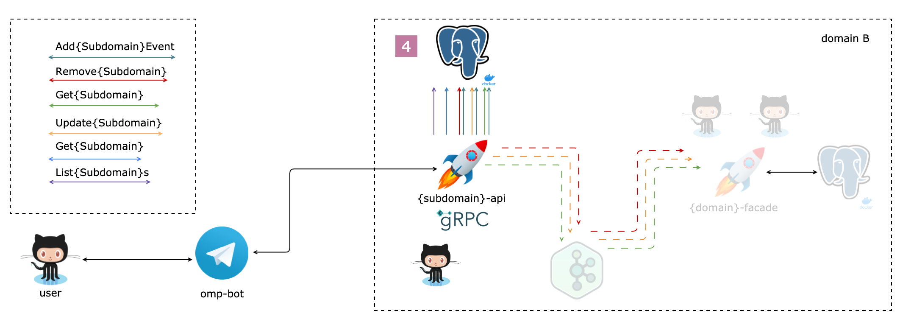

# Ozon Marketplace Project



Дальше везде используются **placeholder**-ы:

- `{domain}`,`{Domain}`
- `{subdomain}`,`{Subdomain}`

Например, для поддомена `package` из домена `logistic` значение **placeholder**-ов будет:

- `{domain}`,`{Domain}` = `logistic`,`Logistic`
- `{subdomain}`,`{Subdomain}` = `package`,`Package`
- `{domain}`/`{subdomain}` = `logistic`/`package`
- `{subdomains}`,`{Subdomains}` = `packages`,`Packages`

---

**Задание IV**

1. Реализовать методы для интерфейса `Repo`
2. Написать миграции для создания таблиц и создания индексов
3. Реализовать методы для интерфейса `RepoEvent` (сообщения в **proto**)
4. Подготовить **dataset** для таблиц `subdomains` и `subdomains_events` :gem:
5. Реализовать поддержку вариаций типов событий на обновление сущности `subdomain` :gem:
6. Обеспечить защиту от **sql**-инъекции :gem:
7. Настроить партиципирование таблицы на **N** частей :gem:
8. Написать тесты :gem:

---

**Рецепт**

Используя паттерн [Transactional Outbox Pattern](https://microservices.io/patterns/data/transactional-outbox.html)

1. Создать таблицы следующих форматов:

`{subdomains}` таблица

| id **bigint** | ...  | removed **bool** | created **timestamp** | updated **timestamp** |
| :-----------: | :--: | :--------------: | :-------------------: | :-------------------: |
|               |      |                  |                       |                       |


`{subdomains}_events` 📤 таблица

| id **bigint** | {subdomain}_id **bigint** | type **text** | status | payload **jsonb**  | updated **timestamp** |
| :-----------: | :-----------------------: | :-----------: | ------ | :----------------: | ------- |
|               |                           |    Created    | lock   | `SubdomainCreated` |         |
|               |                           |    Updated    | lock   | `SubdomainUpdated` |         |
|               |                           |    Removed    |        | `SubdomainRemoved` |         |


2. Составить список sql запросов для таблицы `{subdomains}`, потом для `{subdomains}_events`

```sql
-- Lock n events 🐘 🏆
```

3. Имплементировать методы интерфейсов с помощью [squirell](https://github.com/Masterminds/squirrel)

```go
type Repo interface {
	Add(*model.Subdomain) (uint64, error)
	Get(subdomainID uint64) (*model.Subdomain, error)
	List(limit uint64, cursor uint64) ([]model.Subdomain, error)
	Remove(subdomainID uint64) (bool, error)
}
```


```go
type EventRepo interface {
	Lock(n uint64) ([]model.SubdomainEvent, error)
	Unlock(eventIDs []uint64) error
	Remove(eventIDs []uint64) (bool, error)
}
```

4. Написать и накатить миграции
```sh
$ cd migrations
$ cat .env
PGPASSWORD=docker
PGUSER=docker
$ set -o allexport; source .env; set +o allexport
$ goose postgres "host=localhost sslmode=disable dbname={domain-kw}_{subdomain}_api port=5432" up
$ goose postgres "host=localhost sslmode=disable dbname={domain-kw}_{subdomain}_api port=5432" status
```
5. Поднять сервис и пострелять в него разными запросами [пример](https://github.com/ozonmp/omp-template-api/blob/main/DOCS.md#gateway)
