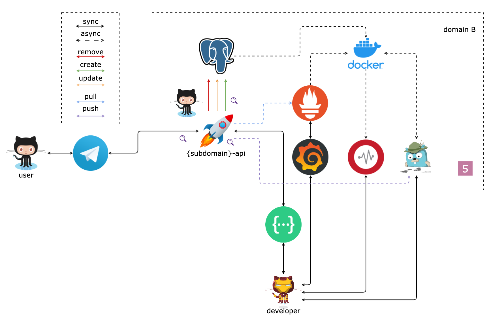

# Ozon Marketplace Project

Дальше везде используются **placeholder**-ы:

- `{domain}`,`{Domain}`
- `{subdomain}`,`{Subdomain}`

Например, для поддомена `package` из домена `logistic` значение **placeholder**-ов будет:

- `{domain}`,`{Domain}` = `logistic`,`Logistic`
- `{subdomain}`,`{Subdomain}` = `package`,`Package`
- `{domain}`/`{subdomain}` = `logistic`/`package`
- `{subdomains}`,`{Subdomains}` = `packages`,`Packages`

---

**Задание V**

_Логирование_

1. Покрыть логированием код обработки ручек со всем уровнем вложенности
2. Добавить поддержку изменения уровня логирования через заголовок запроса
3. Добавить поддержку детализированного вывода запроса и ответа через **middleware** :gem:
4. Добавить отображение в **swagger** отладочных заголовков :gem:

_Трассировка_

1. Добавить создание спанов для ручек
2. Добавить заполнение необходимых полей и ошибок
3. Пострелять с помощью **hey**

_Метрики_

1. Добавить метрики на
   1. Кол-во **NotFound** событий 🔍
   2. Кол-во создаваемых **CUD** событий 🔍
   3. Кол-во обрабатываемых событий в ретрансляторе 🔍
2. Добавить **dashboard** на отображение метрик :gem:
