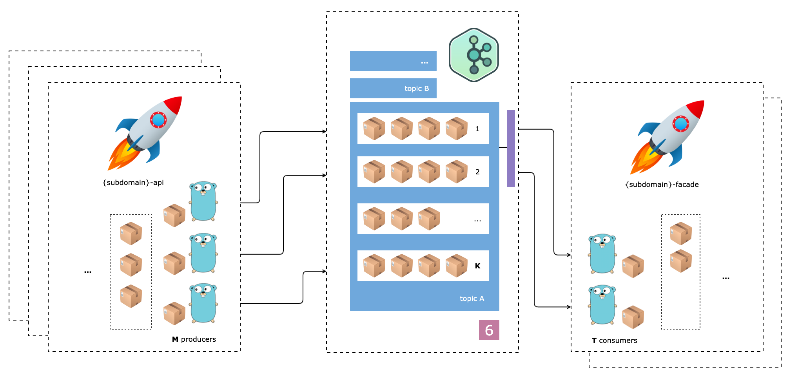

# Ozon Marketplace Project

Дальше везде используются **placeholder**-ы:

- `{domain}`,`{Domain}`
- `{subdomain}`,`{Subdomain}`

Например, для поддомена `package` из домена `logistic` значение **placeholder**-ов будет:

- `{domain}`,`{Domain}` = `logistic`,`Logistic`
- `{subdomain}`,`{Subdomain}` = `package`,`Package`
- `{domain}`/`{subdomain}` = `logistic`/`package`
- `{subdomains}`,`{Subdomains}` = `packages`,`Packages`

---

**Задание VI**

1. Имплементировать отправку событий в **kafka** топик

2. Имплементировать для сервиса `{domain-kw}-{subdomain}-facade` чтение данных из **kafka** топика в стандартный поток вывода

3. Имплементировать **update** операцию

4. Имплементировать сохранение прочтенных данных в базу 💎

5. Добавить поддержку работы с множеством брокеров 💎
