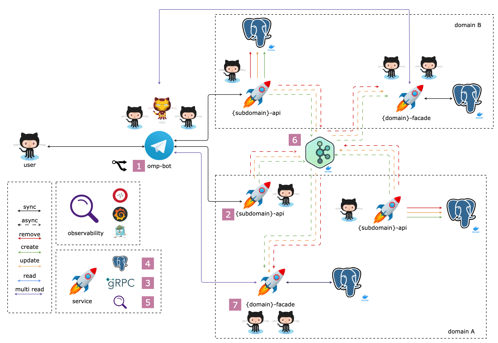

# Ozon Marketplace Project

Дальше везде используются **placeholder**-ы:

- `{domain}`,`{Domain}`
- `{subdomain}`,`{Subdomain}`

Например, для поддомена `package` из домена `logistic` значение **placeholder**-ов будет:

- `{domain}`,`{Domain}` = `logistic`,`Logistic`
- `{subdomain}`,`{Subdomain}` = `package`,`Package`
- `{domain}`/`{subdomain}` = `logistic`/`package`
- `{subdomains}`,`{Subdomains}` = `packages`,`Packages`

---

**Задание VII**

1. Вынести код ретранслятора в отдельный сервис 💎
2. Интегрировать свой форк от **omp-bot** и `{domain-kw}-{subdomain}-api` сервис 💎
3. Интегрировать свой форк от **omp-bot** и `{domain-kw}-{subdomain}-facade` сервис 💎
4. Добавить поддержку множественного количества попыток 💎
    - при подключение к базе
    - при подключение к сервису `{domain-kw}-{subdomain}-api`
    - при отправке событий в **kafka** топик
5. Добавить поддержку кэширования сущности через **redis** 💎
